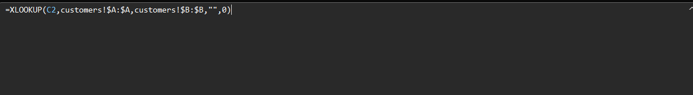
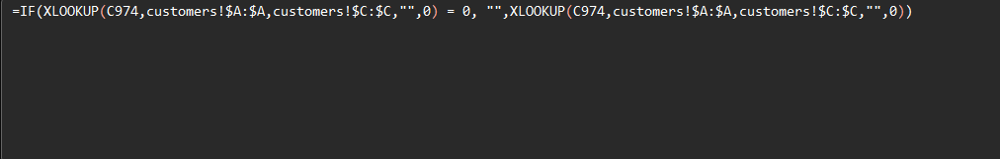
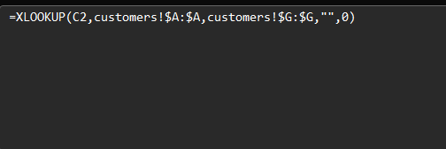
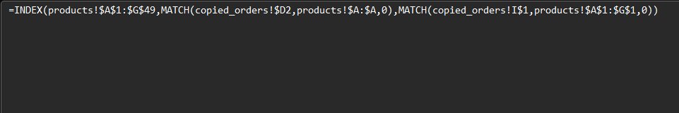
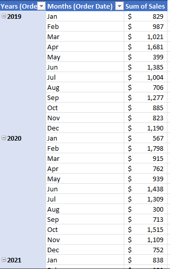
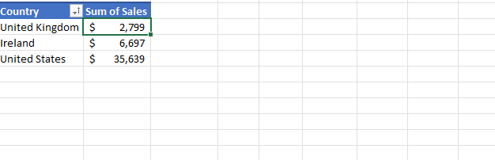
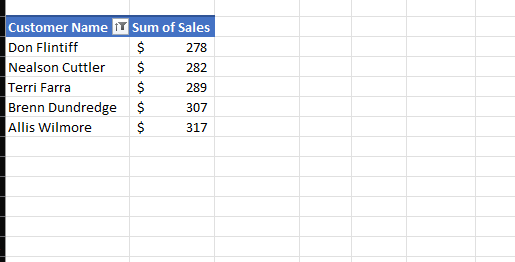
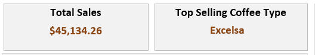

# ☕ Coffee Shop Dashboard

An **interactive Excel dashboard** for analyzing coffee shop sales data.  
This project covers the full process: **data cleaning → data transformation → visualization**.

---

## 📊 Dashboard Preview


---

## 🛠️ Data Cleaning Process

The raw dataset contained missing values, inconsistent labels, and unformatted columns.  
I performed several steps to prepare the data for analysis:

- **Lookups for customer information:**
  - Customer Name
  - Email
  - Country
  - Coffee Type
  - Roast Type
  - Size
  - Unit Price
- **Calculated Sales** column
- **Created new column** for _Loyalty Card_
- **Created new cleaned columns** for Roast Type and Size
- **Applied custom formatting**:
  - Date → `dd-mmm-yyyy`
  - Unit Price & Sales → USD currency

---

## 🔢 Excel Formulas Used

**Customer Name Lookup**


**Email Lookup**


**Country Lookup **


**Coffe Type Lookup index + Match**


**Other Columns using the same INDEX + MATCH logic**

- Roast Type
- Size
- Unit Price
- Loyalty Card

---

**Sales Calculation**

```excel
= Unit Price * Quantity
```

**Standardized Coffee Type Column**

```excel
=IF(I2="Rob","Robiscatic",
 IF(I2="Ara","Arabica",
 IF(I2="Exc","Excelsa",
 IF(I2="Lib","Liberica",""))))
```

**Standardized Roast Type Column**

```excel
=IF(J2="L","Light Roast",
IF(J2="M","Medium Roast",
IF(J2="D","Dark Roast","")))
```

## 🧹 Before & After Cleaning

**Raw Data (before cleaning):**  


**Cleaned Data (after cleaning):**  


---

## 📊 Pivot Tables

**Sales Over Time**  


**Sales by Country**  


**Top Customers**  


---

## 📈 Dashboard KPIs

The dashboard highlights:

- **Total Sales (USD)**
- **Top Selling Coffee Type**  
  
- **Sales Over Time**
- **Top 5 Customers**
- **Sales by Country**
